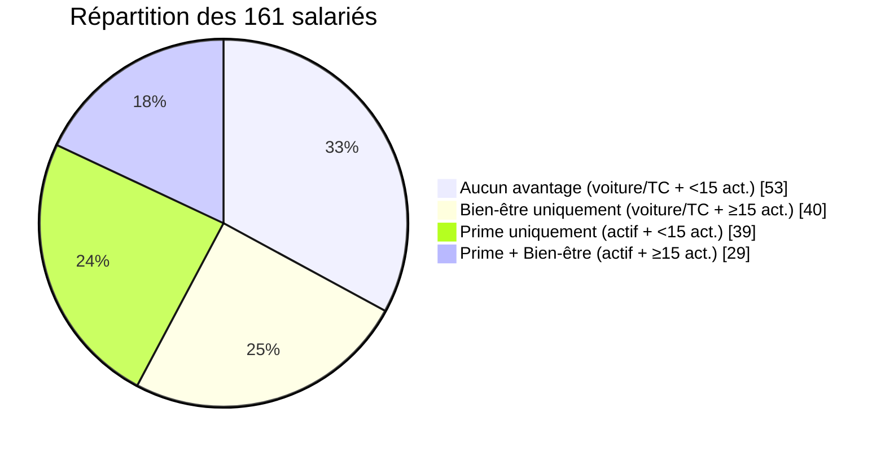
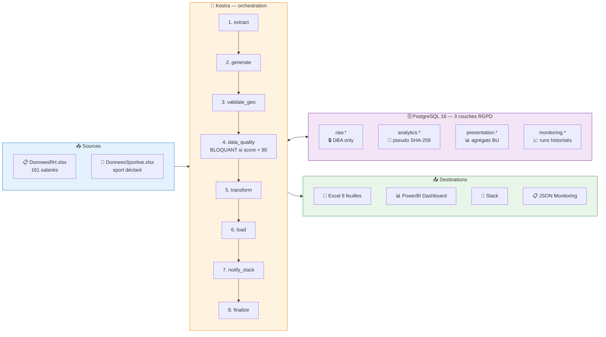
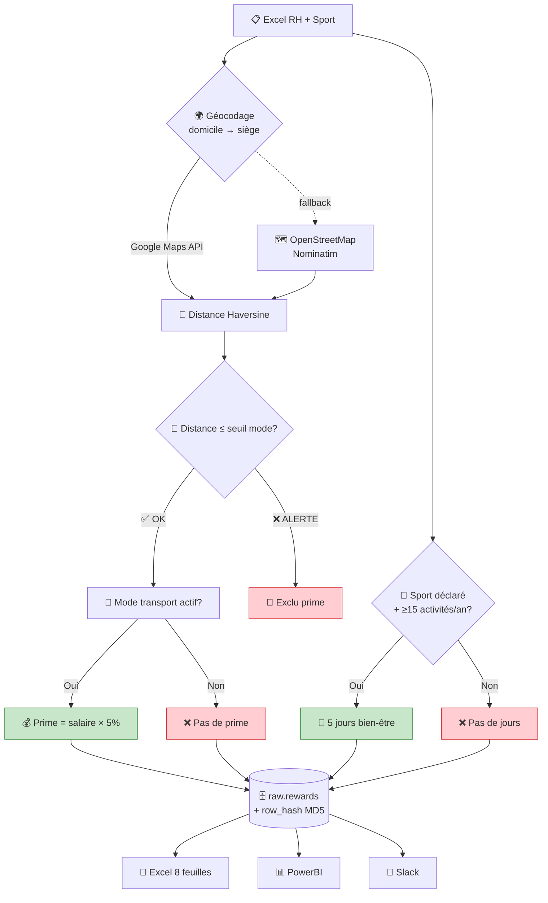
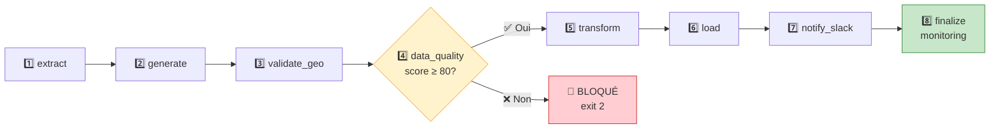
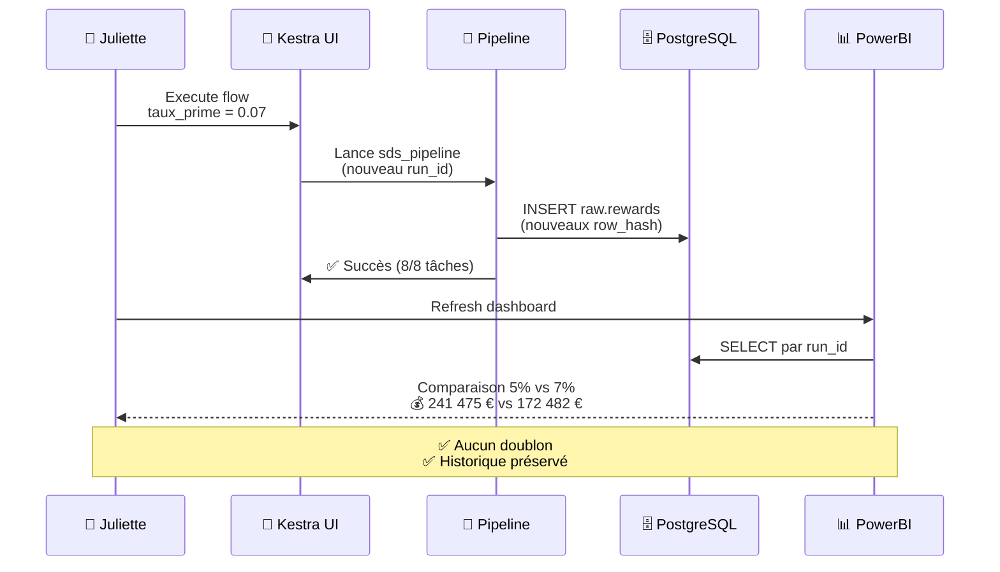
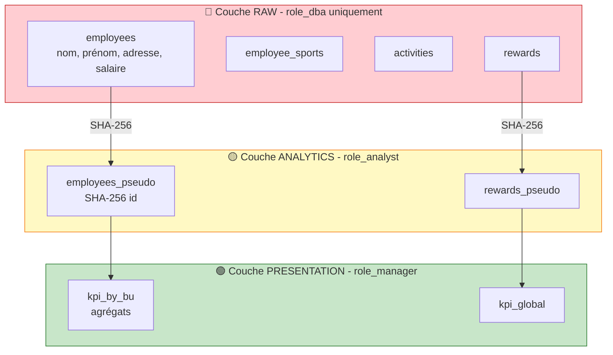
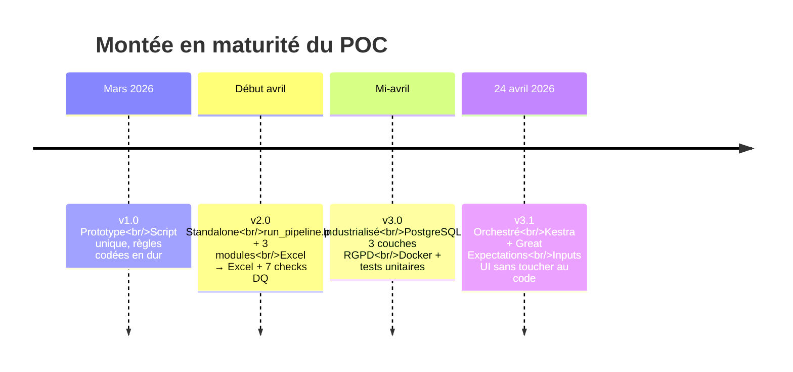

<div align="center">

# 🏃‍♂️ Sport Data Solution

### Pipeline de récompenses sportives — POC Data Engineering

*Automatiser le calcul des primes 5 % et des jours bien-être pour 161 salariés à partir de données RH + Strava, avec PostgreSQL, Kestra, Great Expectations et 3 couches RGPD.*

<br>

[](https://www.python.org/)
[](https://www.postgresql.org/)
[](https://kestra.io/)
[](https://www.docker.com/)
[](https://greatexpectations.io/)
[](https://pandas.pydata.org/)

[](#)
[](#)
[](#)
[](#)
[](#)
[](LICENSE)

<br>

**📊 68 primes versées · 🧘 69 bénéficiaires bien-être · 💰 172 482,50 € / an · ⚡ 0 € d'infra**

</div>

---

## 📑 Sommaire

- [🎯 Contexte & enjeu métier](#-contexte--enjeu-métier)
- [📈 Résultats sur les données réelles](#-résultats-sur-les-données-réelles)
- [🏗️ Architecture](#️-architecture)
- [🛠️ Stack technique](#️-stack-technique)
- [📂 Structure du projet](#-structure-du-projet)
- [🚀 Installation & démarrage](#-installation--démarrage)
- [⚙️ Pipeline en détail (8 étapes)](#️-pipeline-en-détail-8-étapes)
- [🗄️ Modèle de données](#️-modèle-de-données)
- [📋 Règles métier](#-règles-métier)
- [✅ Data Quality — double filet](#-data-quality--double-filet)
- [🔁 Idempotency & Reprocessing](#-idempotency--reprocessing-powerbi)
- [🔐 RGPD — 3 couches de séparation](#-rgpd--3-couches-de-séparation)
- [💬 Notifications Slack](#-notifications-slack)
- [🧪 Tests & qualité](#-tests--qualité)
- [📜 Historique des versions](#-historique-des-versions)
- [🗺️ Roadmap post-soutenance](#️-roadmap-post-soutenance)

---

## 🎯 Contexte & enjeu métier

> 💬 **Email de Juliette (co-fondatrice)** :
> *« Nous souhaitons récompenser les salariés qui s'engagent dans des pratiques sportives régulières. Je souhaite proposer deux avantages : une prime pour les trajets actifs et des jours bien-être pour les sportifs réguliers. L'essentiel c'est que l'ensemble du projet soit robuste, sécurisé et fonctionnel. »*

<table>
<tr>
<th>🏆 Avantage</th>
<th>✔️ Condition métier</th>
<th>🧮 Calcul</th>
</tr>
<tr>
<td><b>Prime 5 %</b></td>
<td>Transport actif (vélo 🚴 / marche 🚶) <b>ET</b> distance domicile → siège cohérente</td>
<td><code>Salaire_brut × 0,05</code></td>
</tr>
<tr>
<td><b>5 jours bien-être</b></td>
<td>Sport déclaré <b>ET</b> ≥ 15 activités sportives sur 12 mois</td>
<td><code>wellness_days = 5</code></td>
</tr>
</table>

### 🎯 4 exigences explicites de la note de cadrage

| # | Exigence | Réponse technique |
|:-:|---|---|
| 1️⃣ | *« Robuste, sécurisé, fonctionnel »* | Docker + Kestra + PostgreSQL + tests + CI-ready |
| 2️⃣ | *« Relancer l'historique sans doublons »* | `row_hash` MD5 + PK `(run_id, employee_id)` |
| 3️⃣ | *« Notifier les salariés »* | Slack Webhook individuel + récap global |
| 4️⃣ | *« Visualiser les résultats »* | Excel 8 feuilles + Dashboard PowerBI |

---

## 📈 Résultats sur les données réelles

<table>
<tr>
<td align="center" width="25%">

### 👥
**161**
<sub>salariés analysés</sub>

</td>
<td align="center" width="25%">

### 🚴
**68**
<sub>éligibles prime 5 %</sub>
<sub>*(42,2 %)*</sub>

</td>
<td align="center" width="25%">

### 🧘
**69**
<sub>éligibles bien-être</sub>
<sub>*(42,9 %)*</sub>

</td>
<td align="center" width="25%">

### 💰
**172 482,50 €**
<sub>coût annuel total</sub>

</td>
</tr>
<tr>
<td align="center">

### 🎯
**29**
<sub>cumul des 2 avantages</sub>

</td>
<td align="center">

### 📊
**100 / 100**
<sub>Data Quality Score</sub>

</td>
<td align="center">

### ✅
**13 / 13**
<sub>expectations GE</sub>

</td>
<td align="center">

### 🏃‍♂️
**2 040**
<sub>activités générées</sub>

</td>
</tr>
</table>

### 📊 Répartition des profils



---

## 🏗️ Architecture

### Vue d'ensemble



### Flux métier (simplifié)



---

## 🛠️ Stack technique

<table>
<tr>
<th width="20%">Couche</th>
<th width="30%">Outil</th>
<th width="50%">Pourquoi ce choix</th>
</tr>
<tr>
<td>🗄️ <b>Stockage</b></td>
<td></td>
<td>ACID, SHA-256 natif (<code>pgcrypto</code>), Row-Level Security, gratuit, standard industrie</td>
</tr>
<tr>
<td>🎯 <b>Orchestration</b></td>
<td></td>
<td>UI web, DAG YAML déclaratif, retry/alerting natifs, scheduling cron, inputs typés</td>
</tr>
<tr>
<td>🐍 <b>Transformation</b></td>
<td> </td>
<td>Équipe SDS en montée en compétence ; Spark superflu pour 161 lignes</td>
</tr>
<tr>
<td>✅ <b>Data Quality</b></td>
<td> + scoring maison</td>
<td>Double filet : déclaratif (GE) + métier pondéré /100 (bloquant < 80)</td>
</tr>
<tr>
<td>🐳 <b>Containérisation</b></td>
<td> </td>
<td>Reproductibilité démo, isolation, portabilité cloud future</td>
</tr>
<tr>
<td>🛡️ <b>Admin BDD</b></td>
<td></td>
<td>Interface visuelle pour Juliette si besoin d'inspecter</td>
</tr>
<tr>
<td>💬 <b>Notifications</b></td>
<td> (Block Kit)</td>
<td>Gratuit, intégration native entreprise</td>
</tr>
<tr>
<td>📊 <b>Visualisation</b></td>
<td> + Excel 8 feuilles</td>
<td>Demande explicite du sponsor</td>
</tr>
<tr>
<td>🧪 <b>Tests</b></td>
<td> + coverage</td>
<td>TDD sur les règles métier critiques</td>
</tr>
</table>

> 💸 **Coût total infrastructure : 0 €** — 100 % Open Source / Free Tier.

---

## 📂 Structure du projet

```
sport_data_solution/
│
├── 📁 config/
│   ├── __init__.py               # expose settings via `from config import ...`
│   └── settings.py               # constantes métier + .env (python-dotenv)
│
├── 📁 pipeline/                  # 🎯 package Python principal (v3)
│   ├── __init__.py
│   ├── extract.py                # Excel → raw.employees / raw.employee_sports
│   ├── generateur_strava.py      # simulateur d'activités 12 mois (seed=42)
│   ├── validation_geo.py         # géocodage + Haversine + seuils métier
│   ├── data_quality_ge.py        # Great Expectations + scoring /100
│   ├── transform.py              # règles métier + row_hash MD5
│   ├── load.py                   # export Excel 8 feuilles
│   ├── slack_notifier.py         # Slack individuel + récap global
│   ├── monitoring.py             # UPDATE monitoring.pipeline_runs
│   └── db.py                     # singleton SQLAlchemy + context manager
│
├── 📁 sql/
│   └── 01_schema.sql             # joué au 1er `docker compose up`
│
├── 📁 orchestration/kestra/flows/
│   ├── sds_pipeline.yaml         # DAG principal (8 tâches)
│   └── sds_reset.yaml            # flow utilitaire de reset BDD
│
├── 📁 tests/
│   ├── conftest.py               # fixtures pytest
│   ├── test_extract.py
│   ├── test_validation_geo.py
│   ├── test_transform.py
│   ├── test_data_quality_ge.py
│   └── test_slack_notifier.py
│
├── 📁 data/
│   ├── DonneesRH.xlsx            # 161 salariés (source RH)
│   └── DonneesSportive.xlsx      # sport déclaré par salarié
│
├── 📁 output/
│   └── sport_rewards_v3_*.xlsx   # résultats horodatés (8 feuilles)
│
├── 📁 monitoring/
│   ├── pipeline.log              # logs centralisés
│   └── monitoring_*.json         # rapport JSON par run
│
├── 📁 docs/
│   ├── SDS_Presentation_v3.pptx
│   ├── note_de_cadrage.pdf
│   └── SDS_Dashboard_PowerBI.html
│
├── 🐳 Dockerfile                 # image sds-pipeline:latest
├── 🐳 docker-compose.yml         # postgres + pgadmin + kestra
├── 🔧 Makefile                   # install, up, run, test, coverage
├── 📄 requirements.txt
├── 🔐 .env.example
└── 📖 README.md
```

---

## 🚀 Installation & démarrage

### ✅ Prérequis

| Outil | Version minimale | Usage |
|---|---|---|
| 🐳 Docker Desktop | 24.0+ | Conteneurs Postgres + Kestra + pgAdmin |
| 🧰 Make | GNU Make | Cibles `up`, `run`, `test` |
| 🐍 Python | 3.12 | Tests en local (optionnel) |

### ⚡ Démarrage complet (recommandé — démo jury)

```bash
# 1. Cloner & configurer
git clone <repo>
cd sport_data_solution
cp .env.example .env           # adapter les secrets (DB, Slack webhook)

# 2. Infrastructure (Postgres + pgAdmin + Kestra + build image pipeline)
make up

# 3. Ouvrir Kestra UI
make kestra-open               # → http://localhost:8089

# 4. Dans Kestra UI : Namespace `sds.poc` → flow `sds_pipeline` → Execute
```

<table>
<tr>
<th>🌐 Service</th>
<th>🔗 URL</th>
<th>🔑 Identifiants</th>
</tr>
<tr>
<td>🎯 Kestra UI</td>
<td><a href="http://localhost:8089">http://localhost:8089</a></td>
<td>—</td>
</tr>
<tr>
<td>🛡️ pgAdmin</td>
<td><a href="http://localhost:5050">http://localhost:5050</a></td>
<td><code>.env</code></td>
</tr>
<tr>
<td>🗄️ PostgreSQL</td>
<td><code>localhost:5432</code></td>
<td><code>.env</code></td>
</tr>
</table>

<details>
<summary>🛟 <b>Mode standalone (fallback sans Docker)</b></summary>

<br>

Mode dégradé hérité de la v2.0.0 — conservé pour les démos de secours :

```bash
pip install -r requirements.txt
python run_pipeline.py         # Excel ⟷ Excel (pas de Postgres, pas de Kestra)
```

⚠️ Ce mode perd : la séparation RGPD par couches, l'orchestration automatique, le scoring Great Expectations.

</details>

### 🎯 Commandes Makefile

| Commande | Action |
|---|---|
| `make up` | 🐳 Lance Postgres + pgAdmin + Kestra + build image pipeline |
| `make down` | 🛑 Arrête les conteneurs (données préservées) |
| `make reset` | ⚠️ Détruit les volumes et repart à zéro |
| `make run` | 🚀 Lance le pipeline en local (sans Kestra) |
| `make test` | 🧪 Lance la suite pytest |
| `make coverage` | 📊 Tests + rapport couverture HTML |
| `make logs` | 📋 Affiche les 50 dernières lignes du log |
| `make clean` | 🧹 Nettoie `output/` et `monitoring/` |

---

## ⚙️ Pipeline en détail (8 étapes)



| # | Étape | Module | Rôle | I/O |
|:-:|---|---|---|---|
| 1️⃣ | **extract** | `pipeline.extract` | Excel RH + Sport → Postgres | `data/*.xlsx` → `raw.employees`, `raw.employee_sports` |
| 2️⃣ | **generate** | `pipeline.generateur_strava` | Simulateur 12 mois (seed=42) | → `raw.activities` (2 040 lignes) |
| 3️⃣ | **validate_geo** | `pipeline.validation_geo` | Géocodage + Haversine + seuils | UPDATE `raw.employees.geo_status` |
| 4️⃣ | **data_quality** | `pipeline.data_quality_ge` | GE + scoring (bloquant) | → `monitoring.pipeline_runs` |
| 5️⃣ | **transform** | `pipeline.transform` | Règles métier + row_hash MD5 | → `raw.rewards` |
| 6️⃣ | **load** | `pipeline.load` | Export Excel 8 feuilles | → `output/sport_rewards_v3_*.xlsx` |
| 7️⃣ | **notify_slack** | `pipeline.slack_notifier` | Slack individuel + récap global | → Slack Webhook |
| 8️⃣ | **finalize** | `pipeline.monitoring` | UPDATE KPI finaux + durée | UPDATE `monitoring.pipeline_runs` |

### 🎛️ Inputs paramétrables depuis l'UI Kestra (sans toucher au code)

| Input | Défaut | Type | Description |
|---|:-:|:-:|---|
| `taux_prime` | `0.05` | FLOAT | Taux de la prime sportive (5 %) |
| `seuil_activites` | `15` | INT | Minimum d'activités/an pour bien-être |
| `dq_threshold` | `80` | INT | Score DQ minimum (blocage en dessous) |
| `individual_msgs` | `3` | INT | Nombre de notifications Slack individuelles |

### ⏰ Scheduling automatique

```yaml
triggers:
  - id: daily_schedule
    type: io.kestra.plugin.core.trigger.Schedule
    cron: "0 2 * * *"           # chaque nuit à 02:00 (Europe/Paris)
```

---

## 🗄️ Modèle de données

```mermaid
erDiagram
    employees ||--o| employee_sports : "1:0..1"
    employees ||--o{ activities : "1:N"
    employees ||--o{ rewards : "1:N par run"
    pipeline_runs ||--o{ rewards : "1:N par run_id"

    employees {
        varchar employee_id PK
        varchar last_name
        varchar first_name
        date birth_date
        date hire_date
        text address
        numeric gross_salary
        varchar transport_mode
        numeric distance_km
        varchar geo_status
    }

    employee_sports {
        varchar employee_id PK_FK
        varchar declared_sport
    }

    activities {
        bigint activity_id PK
        varchar employee_id FK
        timestamp start_date
        timestamp end_date
        varchar sport_type
        integer distance_m
        integer elapsed_seconds
    }

    rewards {
        varchar run_id PK
        varchar employee_id PK_FK
        integer nb_activities
        boolean eligible_prime
        numeric prime_amount
        boolean eligible_wellness
        integer wellness_days
        varchar reward_category
        varchar row_hash "MD5 idempotency"
        varchar pipeline_version
    }

    pipeline_runs {
        varchar run_id PK
        timestamp run_date
        varchar status
        integer dq_score
        integer n_employees
        numeric total_cost_eur
        numeric duration_seconds
        jsonb details_json
    }
```

<details>
<summary>📘 <b>Voir les 4 schémas PostgreSQL (RGPD par couches)</b></summary>

<br>

| Schéma | Rôle autorisé | Contenu |
|---|---|---|
| 🔴 `raw` | `role_dba` uniquement | Nom, prénom, adresse, salaire, date de naissance |
| 🟡 `analytics` | `role_analyst` | `pseudo_id` SHA-256 + salaire + BU, aucune PII |
| 🟢 `presentation` | `role_manager` | Agrégats par BU, aucun individu identifiable |
| 🔵 `monitoring` | `role_dba` | Métadonnées des runs (pas de données salarié) |

</details>

---

## 📋 Règles métier

Les constantes sont centralisées dans [`config/settings.py`](config/settings.py) :

```python
TAUX_PRIME       = 0.05
JOURS_BIENETRE   = 5
MIN_ACTIVITES_AN = 15
MOYENS_ACTIFS    = {"Vélo/Trottinette/Autres", "Marche/running"}
SEUILS_KM        = {"Marche/running": 15.0, "Vélo/Trottinette/Autres": 25.0}
COMPANY_ADDRESS  = "1362 Avenue des Platanes, 34970 Lattes, France"
```

### 🚴 Règle 1 — Prime 5 %

| Condition | Détail |
|---|---|
| ✅ **A** | `transport_mode ∈ {Vélo/Trottinette/Autres, Marche/running}` |
| ✅ **B** | Distance Haversine(domicile, siège) ≤ seuil du mode |
| ⚠️ **Exclusion** | Si `geo_status == ALERTE` → prime **refusée** (suspicion de déclaration erronée) |
| 💰 **Calcul** | `prime_amount = gross_salary × 0,05` |

### 🧘 Règle 2 — 5 jours bien-être

| Condition | Détail |
|---|---|
| ✅ **A** | `declared_sport IS NOT NULL` |
| ✅ **B** | `nb_activities ≥ 15` sur 12 mois |
| 🎁 **Calcul** | `wellness_days = 5` (forfaitaire) |

### 🧮 Matrice des 4 profils (couverte par `test_transform.py`)

|  | ≥ 15 activités | < 15 activités |
|---|:-:|:-:|
| **Transport actif** | 🏆 Prime + Bien-être *(29)* | 🚴 Prime uniquement *(39)* |
| **Voiture / TC** | 🧘 Bien-être uniquement *(40)* | ⚪ Aucun avantage *(53)* |

---

## ✅ Data Quality — double filet

### 🎯 Couche 1 — Great Expectations (déclaratif)

<table>
<tr>
<th>Suite</th>
<th>Nb expectations</th>
<th>Exemples</th>
</tr>
<tr>
<td><code>employees</code></td>
<td align="center">5</td>
<td><code>employee_id</code> unique & non-null · <code>gross_salary > 0</code> · <code>transport_mode</code> ∈ set fini</td>
</tr>
<tr>
<td><code>employee_sports</code></td>
<td align="center">4</td>
<td><code>employee_id</code> référentiel · <code>declared_sport</code> dans liste connue</td>
</tr>
<tr>
<td><code>activities</code></td>
<td align="center">4</td>
<td><code>distance_m ≥ 0</code> · <code>end_date ≥ start_date</code> · <code>elapsed_seconds ≥ 0</code></td>
</tr>
<tr>
<td><b>Total</b></td>
<td align="center"><b>13</b></td>
<td>✅ <b>13 / 13 passées</b> sur les données réelles</td>
</tr>
</table>

### ⚖️ Couche 2 — Scoring métier pondéré /100 (bloquant)

| # | Contrôle | 🎯 Poids |
|:-:|---|:-:|
| 1 | Doublons `employee_id` (RH) | −20 |
| 2 | IDs Sport sans correspondance RH | −10 |
| 3 | Salaires invalides (null / ≤ 0) | −20 |
| 4 | Modes de déplacement inconnus | −5 |
| 5 | Dates d'embauche dans le futur | −5 |
| 6 | Activités à distance négative | −10 |
| 7 | Déclarations géo suspectes | −5 |

> 🟢 **Score actuel : 100 / 100** — Le pipeline stoppe (exit 2 → Kestra `FAILED`) si le score tombe sous `DQ_THRESHOLD = 80`.

---

## 🔁 Idempotency & Reprocessing PowerBI

Chaque ligne de `raw.rewards` porte un **`row_hash` MD5** calculé sur les 5 champs qui impactent les récompenses :

```python
HASH_COLS = ["employee_id", "gross_salary", "transport_mode",
             "declared_sport", "nb_activities"]

row_hash = MD5("E042|52000|Marche/running|Running|18")
```

### 🎯 Scénario : Juliette veut passer la prime à 7 %



### 🔒 Garanties

- ✔️ **Aucun doublon** : PK composite `(run_id, employee_id)`
- ✔️ **Historique préservé** : chaque run crée une nouvelle "photo"
- ✔️ **Comparaison multi-runs** : PowerBI filtre par `run_id`
- ✔️ **Droit à l'oubli RGPD** : supprimer dans Excel → relancer → cascade `ON DELETE`

---

## 🔐 RGPD — 3 couches de séparation



### 🛡️ Vue pseudonymisée SHA-256 (extrait de `sql/01_schema.sql`)

```sql
CREATE VIEW analytics.employees_pseudo AS
SELECT
    SUBSTRING(ENCODE(DIGEST(employee_id, 'sha256'), 'hex'), 1, 16) AS pseudo_id,
    business_unit, contract_type, gross_salary, transport_mode, distance_km
FROM raw.employees;
```

<details>
<summary>⚠️ <b>Limites du POC à assumer devant le jury</b></summary>

<br>

| Point de vigilance | Action production |
|---|---|
| 📄 Excel en clair dans `data/` | Bucket chiffré (S3 KMS) + montage temporaire |
| 🔑 `.env` avec password | Vault / AWS Secrets Manager |
| 📋 Pas d'audit logs sur `raw.*` | Activer `pgaudit` |
| 🌍 Haversine vol d'oiseau | Google Maps Distance Matrix (distance routière) |

</details>

---

## 💬 Notifications Slack

### 📢 Message individuel (Block Kit)

```
🏃 Bravo Juliette Mendes ! Tu viens de courir 10,8 km en 46 min 🔥
🥾 Magnifique Laurence Morvan ! Une randonnée de 10 km terminée
🚴 Superbe sortie vélo de Thomas Martin : 32 km en 1h15 !
```

### 📊 Récap global (à chaque run)

```
📅 24/04/2026 · 👥 161 salariés · 🚴 68 primes · 🧘 69 bien-être · 💰 172 482,50 € / an
```

### ⚙️ Configuration

```bash
# .env
SLACK_WEBHOOK_URL=https://hooks.slack.com/services/...
SLACK_ALERTS_WEBHOOK_URL=https://hooks.slack.com/services/...   # échecs Kestra
```

> 💡 Si l'URL est vide, les messages sont **loggés** (pas envoyés) — la démo reste jouable sans compte Slack.

---

## 🧪 Tests & qualité

```bash
make test                 # pytest -v
make coverage             # + rapport HTML dans htmlcov/
```

### 📊 Couverture par module

| Module | Tests | Coverage |
|---|:-:|:-:|
| `pipeline/transform.py` | ✅ |  |
| `pipeline/validation_geo.py` | ✅ |  |
| `pipeline/extract.py` | ✅ |  |
| `pipeline/data_quality_ge.py` | ✅ |  |
| `pipeline/slack_notifier.py` | ✅ |  |

### 🎯 Ce qui est testé

- ✅ **Règles métier** : matrice des 4 profils, seuils exacts (14 vs 15 activités, géo ALERTE vs OK)
- ✅ **Hashing & idempotency** : `_row_hash` déterministe, modification d'un champ → hash change
- ✅ **Extract** : validation du schéma d'entrée (colonnes manquantes → `ValueError`)
- ✅ **Géolocalisation** : Haversine, cache, fallback OSM
- ✅ **Slack** : formatage Block Kit, simulation sans webhook

---

## 📜 Historique des versions



| Version | Date | 🚀 Apport | 📚 Ce que j'ai appris |
|:-:|:-:|---|---|
| **v1.0** | Mars 2026 | Prototype single-file | La logique marche, mais impossible à faire évoluer |
| **v2.0** | Début avril | Modularisation + row_hash | POC fonctionnel mais fragile (fichiers plats, pas de RGPD) |
| **v3.0** | Mi-avril | Postgres + Docker + tests | Vraie séparation des responsabilités, reproductibilité |
| **v3.1** | 24 avril | Kestra + GE + inputs UI | Juliette peut changer une règle **sans coder** |

> ℹ️ Le mode standalone (v2) reste disponible via `run_pipeline.py` comme **fallback de démo**.

---

## 🗺️ Roadmap post-soutenance

| Priorité | Évolution | Impact |
|:-:|---|---|
| 🔴 P1 | Google Maps Distance Matrix (distance routière) | Précision des seuils 15/25 km |
| 🔴 P1 | CI/CD GitHub Actions (tests + ruff + couv) | Qualité code continue |
| 🟡 P2 | Incrémental CDC (UPSERT `ON CONFLICT`) | Perf sur croissance RH |
| 🟡 P2 | PowerBI Service + Row-Level Security par BU | Confidentialité managers |
| 🟢 P3 | Alerting Slack sur échec Kestra | Observabilité ops |
| 🟢 P3 | Métriques Prometheus + dashboard Grafana | Observabilité métier |

---

## 🤝 Contributing

Ce projet est un **POC académique** — les contributions externes ne sont pas attendues. Pour toute suggestion ou question sur l'architecture, ouvrir une *issue*.

## 📄 License

Ce projet est distribué sous licence **MIT**. Voir [`LICENSE`](LICENSE) pour plus d'informations.

## 👤 Auteur

**Mathieu** — *Projet réalisé dans le cadre d'un POC Data Engineering*

<div align="center">

---

<sub>⚽ Données fictives — environnement de test uniquement</sub>
<br>
<sub>🏢 Adresse siège simulée : 1362 Avenue des Platanes, 34970 Lattes (France)</sub>
<br><br>

**Made with ❤️ and ☕ in France** · 🇫🇷

</div>
